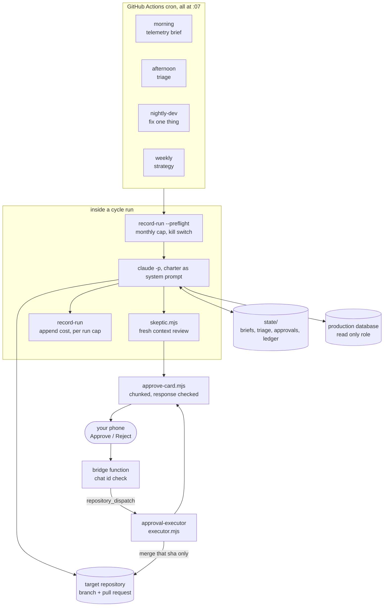
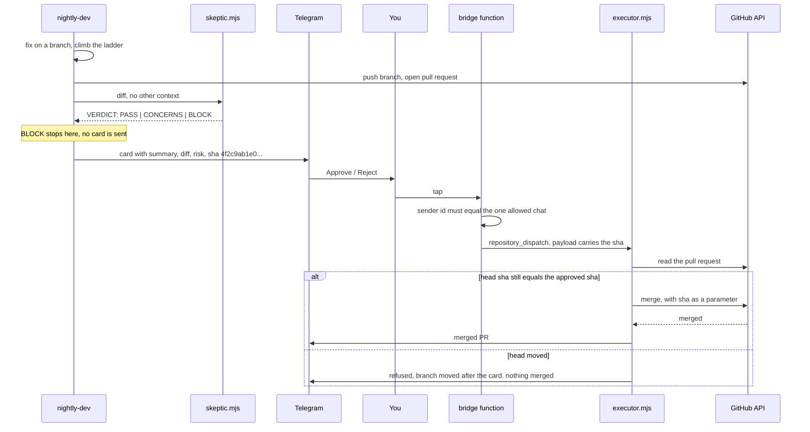

# agent-ops

Run a scheduled AI agent company against your own repository, with human
approval over Telegram.

Four cron jobs on GitHub Actions. Each one wakes a coding agent with a written
charter, a budget, and a narrow job. The agent reads production telemetry,
triages what is broken, fixes one thing on a branch, and proposes it. Nothing
reaches your default branch until a card arrives on your phone with a diff
summary and an exact commit sha, and you tap Approve. The executor then merges
that sha and refuses everything else.

This is a template. Clone it, write your charters, point it at a repository, and
leave the dry run on until you believe it.

## The shape of it



Two properties hold this together. The agent has write access to branches and
no ability to merge, and the executor has merge access and no ability to decide.
Neither half can ship on its own.

## The four cycles

| Cycle | Cron (UTC) | Runs | Writes code | Job |
| --- | --- | --- | --- | --- |
| `morning` | `7 12 * * *` | daily | no | Pull the numbers, compare against yesterday, send one brief |
| `afternoon` | `7 19 * * 1-5` | weekdays | no | Rank what is broken, hand the cheap items to tonight, escalate the rest |
| `nightly-dev` | `7 6 * * 2-6` | weeknights | yes | Fix exactly one item, prove it, open a pull request, file an approval |
| `weekly` | `7 16 * * 0` | Sunday | no | Read the week back, propose charter edits, report what it cost |

The split matters more than the schedule. A single agent asked to observe,
decide, and implement in one run will quietly bend the observation to justify
the implementation it already started. Separating them means the afternoon
cycle's ranking is written down before the nightly cycle sees it, and the weekly
cycle grades both against what actually merged.

The morning cycle is the one that earns its keep first. It is read only, it is
cheap, and after a week you have a written record of what your product was doing
every day, which is the input everything else needs.

### Why every cron ends in :07

Scheduled workflows run on shared capacity and the top of the hour is where
everyone points theirs. Runs queued at `:00` arrive late under load, and a
scheduled run that is late enough is simply dropped. This is documented behavior
and not a rare event: a job on `0 9 * * *` can fire fifty minutes late one day
and not at all the next, with nothing in the Actions log to say why, because a
run that never started has no log.

Seven minutes past the hour is empty. Pick any offset that is not `:00`, `:15`,
or `:30`. A daily brief that silently skips a day is annoying. A weekly strategy
session that skips costs a week.

While you are in there: GitHub cron is always UTC and has no daylight saving. If
you want 07:00 local, you will get 08:00 local for half the year. Either accept
the drift or add a second schedule entry.

## The approval flow, locked to a sha

An approval is a decision about one commit. Not about a branch, and not about a
pull request number. The branch can move between the moment the card is sent and
the moment you tap, and if it moved, then whatever you approved is not what you
read.



The sha appears in three places and has to agree in all of them. It is printed
on the card you read. It travels in the dispatch payload. It is sent to GitHub's
merge endpoint as the `sha` parameter, which makes GitHub itself refuse the
merge if the head moved in the seconds between the check and the call. The
failure mode is a message on your phone saying nothing happened, which is the
correct outcome for an approval that no longer describes reality.

`MERGE_MODE=git` does the same thing with plumbing you can read: clone at full
depth, fetch `pull/<n>/head`, confirm the fetched sha equals the approved one,
then `git merge --ff-only`. If the base moved ahead, the fast forward fails and
nothing is rewritten. Same guarantee, more obvious.

Everything else the executor checks before it gets that far:

- The approval id matches a short slug pattern. A dispatch payload is an input,
  not a fact.
- The repository is on `ALLOWED_REPOS`. Merge access exists for one repository
  and the token should be scoped that way too.
- The pull request is open and not a draft.
- The base is the default branch. A pull request based on another open pull
  request's head would merge that other pull request's commits along with it,
  and your card described only one of them.

### The bridge

Telegram needs somewhere to deliver taps. The bridge is the one piece not in
this repo, because it belongs on whatever serverless host you already use, and
it is small enough to write in one sitting. Its whole contract:

```js
// POST from Telegram. Reject anything that is not from you, turn a tap into a
// repository_dispatch, and always answer 200 so Telegram stops retrying.
export default async function handler(req, res) {
  if (req.headers["x-telegram-bot-api-secret-token"] !== process.env.TELEGRAM_WEBHOOK_SECRET) {
    return res.status(401).send("no");
  }
  const cb = req.body?.callback_query;
  if (!cb) return res.status(200).send("ignored");
  // The authorization model, in one line: one chat may approve.
  if (String(cb.from?.id) !== process.env.TELEGRAM_CHAT_ID) return res.status(403).send("no");

  const m = /^ao:v1:(approve|reject):([a-z0-9._-]{1,40})$/.exec(cb.data ?? "");
  if (!m) return res.status(200).send("unrecognized");
  const [, decision, approvalId] = m;

  // Look up the approval record you stored when the card was sent, so the sha
  // comes from your side rather than from the callback payload.
  const approval = await loadApproval(approvalId);

  await fetch(`https://api.github.com/repos/${process.env.HQ_REPO}/dispatches`, {
    method: "POST",
    headers: { authorization: `Bearer ${process.env.GH_TOKEN_DISPATCH}`, accept: "application/vnd.github+json" },
    body: JSON.stringify({
      event_type: "approval-decision",
      client_payload: { approval_id: approvalId, decision, repo: approval.repo, pr_number: approval.pr_number, head_sha: approval.head_sha },
    }),
  });
  res.status(200).send("dispatched");
}
```

Two details worth keeping. Answer 200 even on a path you ignore, or Telegram
retries the same update forever. And read the sha from your stored approval
record rather than from `callback_data`, which only has 64 bytes to work with
and should carry nothing but an id.

## Governance

The interesting failures of an autonomous system are not the model writing bad
code. They are the system spending money you did not agree to, and acting in
places you assumed it could not reach.

**Per run cost cap.** `record-run.mjs` reads the `total_cost_usd` the CLI
reports, appends a line to a JSONL ledger, and exits 79 if the run went over
`RUNNER_MAX_USD`. It records first and exits second, so the expensive run is in
the ledger either way. Exit 79 is a designed stop, and the alert says so in
those words, because an alert that reads like a crash when it is a budget rule
teaches you to ignore alerts.

**Monthly kill switch.** Before any cycle starts, `record-run.mjs --preflight`
sums the month and exits 78 at `BUDGET_MONTHLY`. Nothing spends after a 78.
Between 80 percent and the cap it reports `posture=lean`, which is passed into
the run so the charter can tell the agent to take the smallest item on the list.
`KILL_SWITCH=1` is the blunt version, checked before anything else, changeable
from a phone through the repository variables screen.

**Dry run by default.** `DRY_RUN` defaults to 1 in every workflow. Cards print
to the log instead of sending, and the executor verifies the whole chain and
merges nothing. The executor has its own `EXECUTOR_DRY_RUN` because an approved
tap that silently no ops behind the cycles' send switch is worse than no
approval flow at all.

**Read only database role.** Telemetry gets a dedicated role with SELECT on the
tables the brief needs. Not the application connection string. The agent that
writes tonight's fix is the same agent that queried production this morning, and
the only real defense there is a credential that cannot write.

**Two tokens, not one.** Cycles get a read only GitHub token. The nightly cycle
gets a write token for pushing a branch and opening a pull request. The executor
gets the write token for merging. Branch protection on the default branch is
what makes "the agent never merges" a rule instead of a promise, so turn it on
before you turn off the dry run.

**Concurrency without cancellation.** Every workflow declares a concurrency
group with `cancel-in-progress: false`. A cancelled run leaves half written
state, and worse, its failure alert never fires, so the cycle that did not
happen looks exactly like the cycle that went fine.

## The skeptic pass

Before anything reaches your phone, a second model reads it with none of the
context that produced it. No charter, no cycle notes, no memory of the
reasoning. Just the diff and a mandate to find what is wrong with it.

This is not redundancy for its own sake. An agent that has spent forty turns on
a change has an implicit stake in that change being good, and it will read its
own diff as confirmation. A fresh context has nothing invested.

The output contract is a forced verdict:

```
VERDICT: PASS | CONCERNS | BLOCK
```

followed by at most six short bullets, each naming something specific. The
parser takes the first verdict token it finds, and prose with no verdict token
is treated as BLOCK. Failing closed matters here, because the natural failure of
a reviewer model is agreeable paragraphs with no judgement in them, and that
must never read as approval.

BLOCK stops the run before a card is sent. CONCERNS does not stop anything: the
text goes onto the card, unedited, under the risk line. That is the right place
for a judgement call, in front of the person who has to live with the result.

One implementation note that cost an evening. The prompt has to come immediately
after `-p`. A variadic flag such as `--allowedTools` placed between them will
swallow a trailing positional prompt, and the CLI then sits waiting on stdin
until the job timeout, having produced nothing.

A second note that cost six cycles of dead reviews before it was root-caused.
The skeptic is a `claude` process spawned from inside another `claude` process,
and the CLI scrubs its own credential variables from every subprocess it
starts. On a laptop you never notice, because the nested CLI falls back to the
keychain. In CI there is no keychain, auth lives entirely in the environment,
and the nested reviewer dies with "Not logged in" no matter what the workflow
passed. The fix is one level of indirection: the workflow stashes the
credential in a file under `$RUNNER_TEMP` before the agent starts, and
`skeptic.mjs` re-reads it when its environment is bare. The scrub strips
variables. It cannot reach the disk.

## Layout

```
.github/workflows/
  morning.yml             telemetry brief, read only
  afternoon.yml           triage, read only
  nightly-dev.yml         the only cycle that writes code
  weekly.yml              strategy and charter edits
  approval-executor.yml   repository_dispatch, the only path to a merge
scripts/
  approve-card.mjs        builds the card, chunks it, checks the response
  executor.mjs            sha verification and merge
  record-run.mjs          cost ledger, per run cap, monthly kill switch
  skeptic.mjs             fresh context review with a forced verdict
charters/
  README.md               what a charter is and the approval record shape
  nightly-dev.md          the worked example, copy it for the other cycles
state/                    the agent's memory, gitignored by default
```

No dependencies. Node 20 or newer, global `fetch`, and `node:child_process`. The
only install any workflow performs is the Claude Code CLI itself.

## Setup

1. **Fork or clone**, then decide what the agent works on. Everything points at
   one repository through `TARGET_REPO`.

2. **Write your charters.** `charters/nightly-dev.md` is a worked example, not a
   default. Copy it to `morning.md`, `afternoon.md`, and `weekly.md` and rewrite
   the boundaries for each. A workflow whose charter is missing fails on the
   first step with a message telling you which file to write.

3. **Secrets**, in Settings > Secrets and variables > Actions:
   `CLAUDE_CODE_OAUTH_TOKEN` (from `claude setup-token`) or
   `ANTHROPIC_API_KEY`, `TELEGRAM_BOT_TOKEN`, `TELEGRAM_CHAT_ID`,
   `GH_TOKEN_READONLY`, `GH_TOKEN_WRITE`, `TELEMETRY_DATABASE_URL`.

4. **Variables**, on the tab beside it: `TARGET_REPO`, `ALLOWED_REPOS`,
   `DEFAULT_BRANCH`, `BUDGET_MONTHLY`, `RUNNER_MAX_USD`, `DRY_RUN=1`,
   `EXECUTOR_DRY_RUN=1`. Optionally `PERSIST_STATE=1` if you want the agent's
   memory committed back to this repo, and the per cycle model overrides.

5. **Stand up the bridge** and register the webhook with your secret:

   ```
   curl -X POST "https://api.telegram.org/botYOUR_BOT_TOKEN/setWebhook" \
     -H 'content-type: application/json' \
     -d '{"url":"https://your-bridge.example.com/api/telegram","secret_token":"YOUR_WEBHOOK_SECRET"}'
   ```

6. **Protect the default branch** of the target repository. Require a pull
   request, and do not give the write token an exemption.

7. **Run it by hand first.** Every workflow has `workflow_dispatch`. Watch a
   morning cycle end to end with `DRY_RUN=1` and read what it wanted to send.

8. **Turn off the dry run** one switch at a time. Cards first, so you see real
   cards for a few days without any of them being able to do anything. Then
   `EXECUTOR_DRY_RUN=0`, and taps start merging.

Locally:

```
cp .env.example .env
node scripts/record-run.mjs --preflight
node scripts/approve-card.mjs --text "hello from agent-ops"   # prints, DRY_RUN=1

# Save the approval record from charters/README.md as card.json, then:
node scripts/approve-card.mjs card.json          # prints the card and the buttons
DRY_RUN=0 node scripts/approve-card.mjs card.json  # sends it for real
```

## Lessons that cost something

**A notification path that cannot fail loudly will fail silently.** Telegram
rejects any single message over 4096 characters. It answers with HTTP 200 and
`{"ok": false, "description": "..."}` in the body, so a send that pipes the
response to `/dev/null` cannot tell a delivered card from a dropped one. A long
risk note is enough to cross the limit, and when it does, the whole card goes,
buttons included. That failure looks identical to a quiet week: no card, no
error, no tap, and the assumption that the agent simply had nothing to propose.
It ran for days before anyone went looking. The fix is two lines of discipline.
Chunk before sending, and parse the response body rather than the status code.
`approve-card.mjs` does both, and falls back to the shortest card that can still
carry a tap when the full one will not go through.

**A status column that nothing writes to is not evidence.** An agent auditing a
feature found a `verified` field, saw it on the record, and reported the feature
working. Nothing in the codebase ever set that field. The audit was confident,
specific, and wrong, and it was wrong in the most expensive direction, which is
declaring something safe. Evidence is command output, a query result, or a
request you actually made. A field that exists is a fact about the schema and
says nothing about behavior. Charters carry this rule explicitly now, and the
verification ladder asks for pasted output rather than a summary of it.

**Never base a pull request on another open pull request's head.** It reads as
efficient when the second change depends on the first. What it means is that
merging the second one merges the first one too, including whatever was still
being argued about in review, and your approval card described one of them. The
executor refuses any pull request whose base is not the default branch, and the
nightly charter forbids branching from anything else. If work genuinely depends
on unmerged work, that is a reason to wait, not a reason to stack.

**A depth 1 clone cannot reason about history.** Shallow clones are the sensible
default for CI and the wrong default here. Ask an agent when a behavior changed,
or what else touched a file, and with one commit of history it will answer
anyway, from the shape of the code and its own confidence. `git log` returning
almost nothing does not read as an error to a model, it reads as a small
project. Clone at full depth for anything that reasons about the past, or
unshallow before you ask.

**Distinguish designed stops from crashes in the alert text.** Exit 78 for the
monthly cap and 79 for the per run cap, with alerts that name them in plain
words. When every stop looks like a fire, you stop reading the alerts, and then
a real one arrives and does nothing.

**Do not cancel a run in flight.** `cancel-in-progress: true` looks tidy on a
scheduled workflow. A cancelled job runs zero further steps, including the
failure alert, so the run that vanished is indistinguishable from the run that
went fine.

## What this template does not include

The bridge function, sketched above and yours to host. Any product specific
telemetry, since the queries that matter are the ones about your own numbers.
The rest of the agent roles you may want beyond the four cycles here. And a
promise that this is safe to point at production on day one, which is what the
dry run defaults, the branch protection step, and the read only database role
are all there to earn.

## License

MIT. See [LICENSE](LICENSE).

---

This is the sanitized skeleton of a system that has run daily against a
production SaaS since July 2026, merging 40+ human-approved PRs. Built by
Abdulrahman Mohamud (usepitlane.com).
